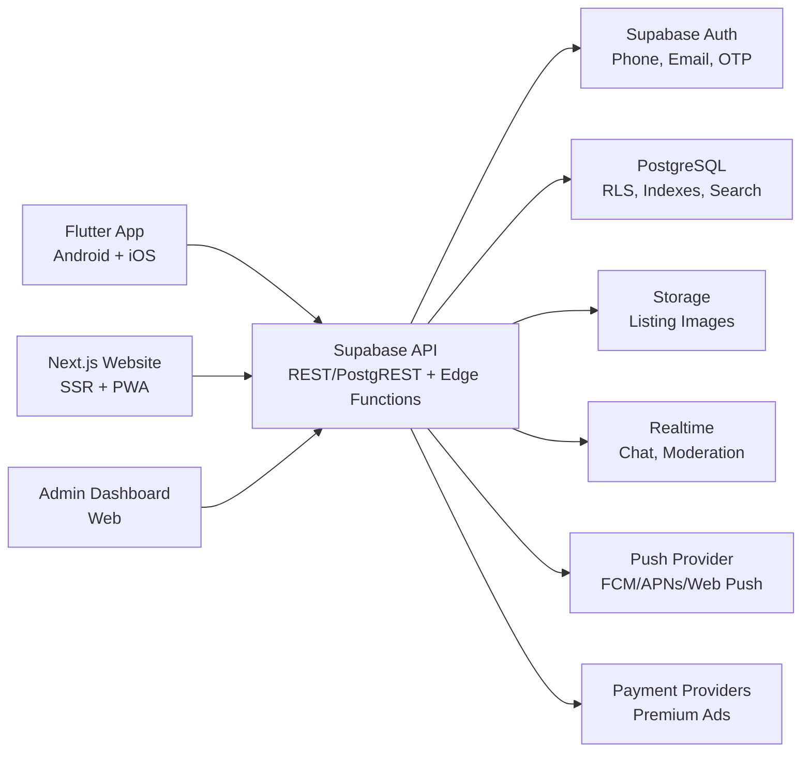

# Yemen Marketplace Product Architecture

## 1. Vollstaendige Systemarchitektur

Die Plattform besteht aus drei Clients mit einem gemeinsamen Backend:

- Mobile App: Flutter fuer Android und iOS, optimiert fuer guenstige Android-Geraete, Offline-Entwuerfe und Push Notifications.
- Website: Next.js App Router mit Tailwind CSS, serverseitig gerenderte Listing-Seiten fuer SEO, PWA-Support und schnelle Kategorie-/Stadtseiten.
- Backend: Supabase als Backend-Plattform mit PostgreSQL, Auth, Storage, Realtime, Edge Functions und Row Level Security.



Kernprinzipien:

- Public Listing Reads sind schnell, cachebar und SEO-freundlich.
- Schreiboperationen laufen nur authentifiziert und mit RLS-Regeln.
- Chat, Favoriten, Reports und Premium-Status sind user-gebunden.
- Moderation ist getrennt nach Rollen User, Moderator und Admin.
- Bilder werden vor Upload komprimiert und in mehreren Groessen ausgeliefert.

## 2. UI/UX Design

Designrichtung: neutral, professionell, minimalistisch, mobile-first, mit starken Vertrauenssignalen.

- Farben: Weiss, Hellgrau, Blau, mit klaren Dark-Mode-Alternativen.
- Typografie: grosse, gut lesbare Titel; kompakte Metadaten; keine dekorativen Fonts.
- Layout: Bottom Navigation auf Mobile, Header + Suchleiste auf Desktop, klare Filterleisten.
- Vertrauen: verifizierte Seller-Badges, Report-Button, sichere Chat-Hinweise, sichtbare Standortdaten.
- Performance-Gefuehl: Skeletons, optimierte Bilder, kurze Formulare und sofortiges lokales Feedback.
- Sprachen: Arabisch als RTL-Primärsprache, Englisch als LTR-Zweitsprache.

## 3. Mobile App Screens

- Splash / App Update Check
- Onboarding mit Sprache, Stadt und Login-Option
- Login / Registrierung per Telefon, E-Mail oder OTP
- Home Feed mit Suche, Kategorien, Premium-Anzeigen und Standortfilter
- Kategorie-Seite mit Sortierung, Preisfilter und Stadtfilter
- Suchergebnisse mit gespeicherten Suchen
- Listing Detail mit Galerie, Seller-Profil, WhatsApp, Chat, Teilen und Report
- Anzeige erstellen: Kategorie, Titel, Preis, Stadt, Beschreibung, Bilder, Vorschau
- Meine Anzeigen: aktiv, ausstehend, abgelehnt, verkauft, Premium
- Favoriten
- Chat Inbox
- Chat Detail mit Bildnachrichten und Safety-Hinweisen
- Profil bearbeiten
- Verifizierung beantragen
- Zahlungs-/Premium-Screen
- Einstellungen: Sprache, Dark Mode, Benachrichtigungen, Datenschutz

## 4. Website Seiten

- `/` Startseite mit Suche, Kategorien, Stadt-Einstieg und Premium-Anzeigen
- `/listings` indexierbare Anzeigenuebersicht mit Filter-Query-Params
- `/listings/[id]` oeffentliche SEO-Detailseite mit strukturierten Daten
- `/categories/[slug]` SEO-Kategorieseiten
- `/cities/[city]` SEO-Stadtseiten
- `/post` Anzeige erstellen
- `/profile` eigenes Profil, Anzeigen, Favoriten, Chats
- `/seller/[id]` oeffentliches Seller-Profil
- `/chat` Web-Chat
- `/admin` Admin Dashboard
- `/auth/login`, `/auth/register`, `/auth/callback`
- `/terms`, `/privacy`, `/safety`

SEO:

- Server Components fuer public pages
- sprechende Slugs, canonical URLs und `hreflang` fuer `ar`/`en`
- JSON-LD fuer `Product`, `Offer`, `LocalBusiness` wo passend
- Sitemap pro Kategorie/Stadt, paginiert
- robots-Regeln fuer private Bereiche

## 5. Datenbankstruktur

Empfohlene Kern-Tabellen:

```sql
profiles(
  id uuid primary key references auth.users(id) on delete cascade,
  display_name text not null,
  phone text unique,
  email text unique,
  city text,
  avatar_url text,
  role text not null default 'user' check (role in ('user', 'moderator', 'admin')),
  verified boolean not null default false,
  language text not null default 'ar' check (language in ('ar', 'en')),
  created_at timestamptz not null default now(),
  updated_at timestamptz not null default now()
);

categories(
  id uuid primary key default gen_random_uuid(),
  slug text unique not null,
  name_ar text not null,
  name_en text not null,
  icon text,
  parent_id uuid references categories(id),
  sort_order int not null default 0
);

listings(
  id uuid primary key default gen_random_uuid(),
  seller_id uuid not null references profiles(id) on delete cascade,
  category_id uuid not null references categories(id),
  title text not null,
  title_en text,
  description text not null,
  price numeric,
  currency text not null default 'YER',
  city text not null,
  district text,
  lat double precision,
  lng double precision,
  condition text,
  status text not null default 'pending' check (status in ('draft', 'pending', 'active', 'sold', 'rejected', 'removed')),
  premium_until timestamptz,
  view_count int not null default 0,
  search_vector tsvector,
  created_at timestamptz not null default now(),
  updated_at timestamptz not null default now()
);

listing_images(
  id uuid primary key default gen_random_uuid(),
  listing_id uuid not null references listings(id) on delete cascade,
  storage_path text not null,
  public_url text not null,
  width int,
  height int,
  sort_order int not null default 0,
  created_at timestamptz not null default now()
);

favorites(
  user_id uuid references profiles(id) on delete cascade,
  listing_id uuid references listings(id) on delete cascade,
  created_at timestamptz not null default now(),
  primary key(user_id, listing_id)
);

conversations(
  id uuid primary key default gen_random_uuid(),
  listing_id uuid references listings(id) on delete set null,
  buyer_id uuid not null references profiles(id),
  seller_id uuid not null references profiles(id),
  last_message_at timestamptz not null default now(),
  created_at timestamptz not null default now(),
  unique(listing_id, buyer_id, seller_id)
);

messages(
  id uuid primary key default gen_random_uuid(),
  conversation_id uuid not null references conversations(id) on delete cascade,
  sender_id uuid not null references profiles(id),
  body text,
  image_url text,
  read_at timestamptz,
  created_at timestamptz not null default now()
);

reports(
  id uuid primary key default gen_random_uuid(),
  listing_id uuid references listings(id) on delete cascade,
  reporter_id uuid references profiles(id) on delete set null,
  reason text not null,
  details text,
  status text not null default 'open' check (status in ('open', 'reviewing', 'resolved', 'dismissed')),
  created_at timestamptz not null default now()
);

premium_orders(
  id uuid primary key default gen_random_uuid(),
  user_id uuid not null references profiles(id),
  listing_id uuid not null references listings(id),
  plan text not null,
  amount numeric not null,
  currency text not null default 'YER',
  provider text,
  provider_reference text,
  status text not null default 'pending',
  created_at timestamptz not null default now()
);

device_tokens(
  id uuid primary key default gen_random_uuid(),
  user_id uuid not null references profiles(id) on delete cascade,
  platform text not null check (platform in ('android', 'ios', 'web')),
  token text not null,
  created_at timestamptz not null default now(),
  unique(platform, token)
);
```

Wichtige Indexe:

- `listings(status, city, category_id, created_at desc)`
- `listings(premium_until desc nulls last, created_at desc)`
- GIN-Index auf `search_vector`
- `messages(conversation_id, created_at)`
- `favorites(user_id, created_at desc)`
- `reports(status, created_at desc)`

## 6. API Struktur

REST ueber Supabase/PostgREST plus Edge Functions fuer komplexe Aktionen:

```txt
POST   /auth/register
POST   /auth/login
POST   /auth/otp/verify
GET    /profiles/me
PATCH  /profiles/me
POST   /profiles/me/verify

GET    /listings?city=&category=&q=&min=&max=&sort=&page=
POST   /listings
GET    /listings/:id
PATCH  /listings/:id
DELETE /listings/:id
POST   /listings/:id/images
POST   /listings/:id/favorite
DELETE /listings/:id/favorite
POST   /listings/:id/report
POST   /listings/:id/share

GET    /conversations
POST   /conversations
GET    /conversations/:id/messages
POST   /conversations/:id/messages

POST   /premium/checkout
POST   /premium/webhook

GET    /admin/overview
GET    /admin/reports
PATCH  /admin/reports/:id
PATCH  /admin/listings/:id/moderate
PATCH  /admin/users/:id/role
```

Realtime Channels:

- `conversation:{id}` fuer neue Nachrichten und Lesestatus
- `user:{id}:notifications` fuer Premium, Reports und Chat-Hinweise
- `admin:moderation` fuer neue Reports und pending Listings

## 7. Admin Dashboard

Funktionen:

- Uebersicht: aktive Anzeigen, pending Anzeigen, Reports, Nutzerwachstum, Premium-Umsatz
- Moderationsqueue mit Approve, Reject, Remove, Seller warnen
- Report-Management nach Grund, Status und Risiko
- User-Management mit Rollen, Verifizierung, Sperrung
- Kategorie- und Stadtverwaltung
- Premium-Planverwaltung
- Audit Log fuer Admin-Aktionen
- Manuelle Push-/Systemmeldungen fuer wichtige Produktinfos

## 8. Authentifizierungssystem

- Supabase Auth als Identitaetsprovider
- Login per Telefonnummer mit OTP, E-Mail Magic Link oder E-Mail/Passwort
- JWT-basierte Sessions fuer Mobile und Web
- RLS prueft `auth.uid()` fuer eigene Daten
- Rollen in `profiles.role`, Adminzugriff nur serverseitig validiert
- Optional: Seller Verification mit Dokument-/Telefonpruefung
- Rate Limiting fuer OTP, Login, Chat und Listing-Erstellung

Beispiel-RLS:

```sql
create policy "Public can read active listings"
on listings for select
using (status = 'active');

create policy "Users can manage own listings"
on listings for all
using (seller_id = auth.uid())
with check (seller_id = auth.uid());
```

## 9. Monetarisierungsmodell

- Premium-Anzeigen: Hervorhebung fuer 7, 14 oder 30 Tage
- Top-Platzierungen in Kategorie und Stadt
- Verifizierte Seller-Badges als optionales Paket
- Shop-Abos fuer Haendler mit mehr Anzeigen, Analytics und Teamzugriff
- B2B-Pakete fuer Autos, Immobilien, Jobs und Solarprodukte
- Dezente lokale Werbeplaetze, klar getrennt von organischen Anzeigen
- Spaeter: sichere Zahlungs-/Treuhandfunktionen, falls Markt und Regulierung passen

## 10. Deployment Strategie

Website:

- Vercel fuer Next.js, Edge Caching und Preview Deployments
- Production, Staging und Development Environments
- ISR/SSR fuer Listing-, Kategorie- und Stadtseiten

Backend:

- Supabase Production Project
- Supabase Staging Project fuer Migrationstests
- SQL-Migrationen versioniert im Repo
- Storage Buckets: `listing-images`, `avatars`, `verification-docs`
- Edge Functions fuer Payments, Push und Moderation Jobs

Mobile:

- Flutter CI Build fuer Android APK/AAB und iOS IPA
- Firebase Cloud Messaging fuer Push
- Feature Flags fuer langsamen Rollout
- Crash Reporting und Performance Monitoring

## 11. Sicherheitskonzept

- Row Level Security fuer alle privaten Tabellen
- Least-privilege Service Role nur in Edge Functions, niemals im Client
- Storage Policies: public read fuer freigegebene Listing-Bilder, private verification docs
- Upload-Schutz: Dateityp pruefen, Groessenlimit, Bild-Re-Encoding
- Spam-Schutz: Rate Limits, Telefonnummer-Verifikation, Report Scoring
- Chat-Schutz: Blockieren, Melden, Link-/Telefon-Heuristiken
- Admin-Schutz: 2FA, Rollen, Audit Logs
- Datenschutz: minimale personenbezogene Daten, klare Loeschpfade
- Backups: taegliche DB-Backups und getestete Restore-Prozesse

## 12. Dateistruktur

Monorepo-Vorschlag:

```txt
yemen-marketplace/
  apps/
    web/                 # Next.js + Tailwind
    mobile/              # Flutter
    admin/               # optional getrennt, sonst Teil von web
  packages/
    api-contracts/       # shared DTOs, OpenAPI, types
    design-tokens/       # Farben, Spacing, Typografie
    i18n/                # ar/en Uebersetzungen
  supabase/
    migrations/
    functions/
    seed.sql
  docs/
    product-architecture.md
```

Aktuelle Demo-Struktur in diesem Workspace:

```txt
app/
  api/
  listings/
  admin/
  profile/
components/
public/
docs/
```

## 13. Komponentenstruktur

Web-Komponenten:

- `Header`
- `MobileNav`
- `SearchBar`
- `CategoryGrid`
- `CitySelector`
- `FilterSheet`
- `ListingCard`
- `ListingGallery`
- `SellerTrustPanel`
- `FavoriteButton`
- `ShareButton`
- `WhatsAppButton`
- `ReportDialog`
- `ChatInbox`
- `ChatThread`
- `ListingForm`
- `ImageUploader`
- `PremiumPlanSelector`
- `AdminStats`
- `ModerationQueue`
- `UserRoleTable`

Flutter-Struktur:

```txt
lib/
  app/
  core/
    config/
    theme/
    i18n/
    network/
    storage/
  features/
    auth/
    home/
    listings/
    listing_detail/
    create_listing/
    chat/
    favorites/
    profile/
    premium/
    settings/
  shared/
    widgets/
    models/
    services/
```

## 14. Responsive Design System

Breakpoints:

- `xs`: 360px, kleine Android-Geraete
- `sm`: 640px
- `md`: 768px
- `lg`: 1024px
- `xl`: 1280px

Tokens:

- Primary: `#1d66bd`
- Primary light: `#eef6ff`
- Text: `#152033`
- Surface: `#ffffff`
- Background: `#f7f9fc`
- Border: `#e2e8f0`
- Dark background: `#0f1724`
- Radius: 8px fuer Cards und Controls
- Button height: mindestens 48px mobile
- Touch target: mindestens 44x44px

Patterns:

- Mobile: 1-spaltige Feeds, Bottom Nav, Filter als Sheet
- Tablet: 2-spaltige Cards, sticky Filter
- Desktop: Search + Sidebar Filter + 3/4-spaltiger Feed
- RTL/LTR: Layout-Richtung ueber Locale, Icons fuer Navigation spiegeln
- Dark Mode: system preference plus manueller Toggle
- Low bandwidth: kleine Bildvarianten, lazy loading, reduzierte Animationen, Offline-Entwuerfe

## Skalierung auf Millionen Nutzer

- Read-heavy Feed ueber Indexe, Pagination und CDN-Caching
- Schreiblast durch Edge Functions und DB Constraints kontrollieren
- Listing-Suche mit PostgreSQL Full Text, spaeter Meilisearch/Typesense moeglich
- Bilder ueber CDN und Transformationen ausliefern
- Background Jobs fuer Moderation, Push und Sitemaps
- Observability: Web Vitals, API Latency, DB Query Monitoring, Error Tracking
- Feature Flags fuer Premium, Payments, Verification und neue Kategorien
